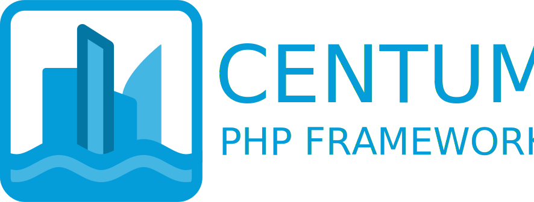

{: style="width: 100%; height: auto;"}

Centum is an all-encompassing PHP framework designed to simplify the building of MVC-style web applications.
It provides a solid foundation while remaining flexible enough for developers to extend and customise according to their project’s needs.

**Centum is currently under heavy development.**
Breaking changes will occur, so it is not yet recommended for production-critical applications.

Centum is named after [Centum City (센텀시티)](https://en.wikipedia.org/wiki/Centum_City), a neighbourhood in Busan, South Korea.
The name symbolises a modern, forward-looking framework built with scalability and performance in mind.

## Requirements

Centum requires a minimum of **PHP 8.4** with the [intl extension](https://www.php.net/manual/en/book.intl.php) and the [yaml extension (version 2)](https://www.php.net/manual/en/book.yaml.php).

This allows the framework to take advantage of the latest language features and performance improvements, while encouraging developers to write modern, type-safe code.

## Technologies

Centum uses the following technologies:

- [PHP 8.4](https://www.php.net/) or later
- [nginx](https://nginx.org/) as the preferred web server
- [Composer](https://getcomposer.org/) for dependency management
- [Docker Compose](https://docs.docker.com/compose/) for containerisation
- [Codeception](https://codeception.com/) for testing
- [Psalm](https://psalm.dev/) for static analysis
- [Twig](https://twig.symfony.com/) for templating
- [Beanstalkd](https://beanstalkd.github.io/) for job queue management

It is assumed that a developer using Centum has at least some familiarity with all of these items.
